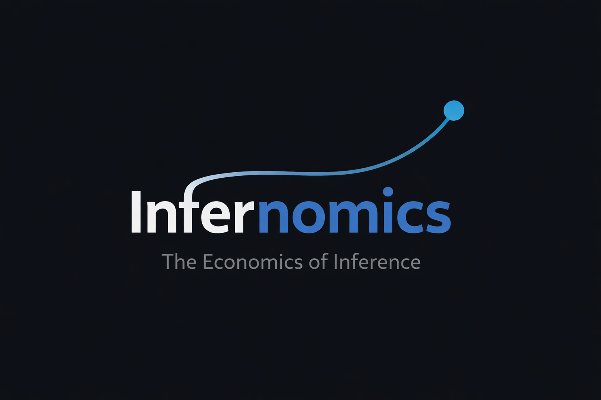

<p align="center">
  
</p>

<br>

## Key Findings

• Increasing top_k improves quality but shows diminishing returns per euro.
• Prompt caching reduces billed cost near-linearly with hit rate.
• Evaluation overhead is measurable and must be accounted for.
• RAG shifts the cost–latency frontier but is not strictly dominant.


# Infernomics - LLM Inference Economics Dashboard

> Treating inference like a financial system.

Infernomics is a practical benchmarking and observability framework for
Large Language Model (LLM) systems.\
It measures **cost, latency, caching gains, retrieval tradeoffs, and
evaluation overhead** --- and visualizes them in a polished Streamlit
dashboard.

------------------------------------------------------------------------

## What This Project Demonstrates

This project showcases applied AI engineering skills in:

-   LLM cost accounting (µ€ precision per request)
-   Latency vs output-token tradeoff analysis
-   Prompt caching impact modeling
-   Retrieval-Augmented Generation (RAG) benchmarking
-   Retrieval depth (top_k) optimization
-   LLM-as-judge quality + groundedness scoring
-   Evaluation overhead cost tracking
-   Dashboard-based experiment visualization

It reflects production-oriented thinking: cost, performance, and quality
must be optimized together --- not in isolation.

------------------------------------------------------------------------

## Key Capabilities

### 1. Chat Sweep Benchmarking

-   Sweep over `max_output_tokens`
-   Measure tokens in/out, latency, cost per request
-   Identify cheapest and fastest configurations
-   Plot cost--latency frontier

### 2. Prompt Caching Experiments

-   Cold vs warm comparison
-   Controlled cache hit-rate sweep (0% → 100%)
-   Billed cost modeling
-   Latency savings visualization

### 3. RAG Benchmarking

-   Small corpus + embeddings index
-   Compare Chat vs RAG cost--latency frontier
-   Measure embedding overhead separately
-   Sweep retrieval depth (`top_k`)

### 4. LLM-as-Judge Evaluation

-   Quality scoring (0--5)
-   Groundedness scoring (0--5)
-   Instruction-follow rate
-   Evaluation overhead cost tracking
-   Quality-per-euro optimization

------------------------------------------------------------------------

## Example Findings

From sample runs:

-   Increasing `top_k` improves judged quality but shows diminishing
    returns relative to cost.
-   Prompt caching reduces billed cost approximately linearly with hit
    rate.
-   Evaluation overhead is measurable and should be tracked explicitly.
-   RAG shifts the cost--latency frontier but is not always strictly
    dominant.

------------------------------------------------------------------------

## Tech Stack

-   Python (venv-based workflow)
-   OpenAI API (chat + embeddings)
-   Pandas / NumPy
-   SQLite (experiment logging)
-   Streamlit + Altair (interactive dashboard)
-   Matplotlib (saved plots)

------------------------------------------------------------------------

## Project Structure

    infernomics/
    ├── assets/                  # Logo + screenshots
    ├── data/                    # Eval sets + RAG corpus
    ├── outputs/
    │   └── reports/             # CSV reports + saved plots
    ├── scripts/                 # Runnable experiment scripts
    ├── src/icp/                 # Core benchmarking logic
    ├── streamlit_app.py         # Dashboard
    ├── requirements.txt
    └── README.md

------------------------------------------------------------------------

## Quickstart

### 1. Create environment

``` powershell
python -m venv .venv
.\.venv\Scripts\activate
pip install -r requirements.txt
```

### 2. Set environment variables

Create `.env`:

    OPENAI_API_KEY=your_key_here
    MODEL=gpt-4o-mini
    EMBED_MODEL=text-embedding-3-small
    VS_CURRENCY=eur

### 3. Run benchmarks

``` powershell
python scripts\make_eval_set.py
python scripts\run_sweep.py
python scripts\run_cache_experiment.py
python scripts\cache_hit_rate_sweep.py
python scripts\make_rag_corpus.py
python scripts\build_rag_index.py
python scripts\run_rag_sweep.py
python scripts\run_rag_topk_sweep.py
```

### 4. Launch dashboard

``` powershell
streamlit run streamlit_app.py
```

------------------------------------------------------------------------

## Why This Matters

Most LLM projects focus on model quality.

Few teams rigorously measure:

-   Cost per request
-   Cache efficiency
-   Retrieval tradeoffs
-   Evaluation overhead
-   Quality-per-euro

Infernomics provides a structured framework for optimizing LLM systems
under real-world constraints.

------------------------------------------------------------------------

## Author

Nicholai Gay --- AI Engineering (LLM Systems & Applied Optimization)

Open to AI Engineering, LLM Systems, and ML Infrastructure roles.

------------------------------------------------------------------------

Generated on 2026-02-22 (UTC)
