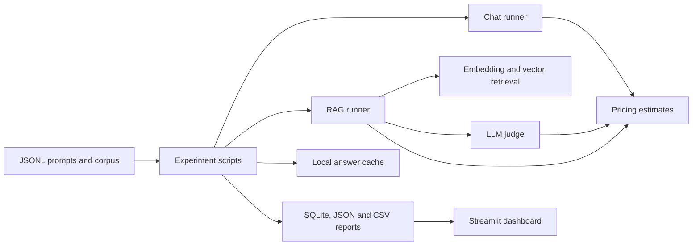

<p align="center"></p>

# Infernomics

**An experiment workbench for the economics of LLM inference.** Infernomics compares estimated request cost, latency, cache behavior, retrieval depth, and model-judged answer quality. It helps answer a practical question: *which configuration delivers enough quality for the time and money spent?*

[](https://github.com/QinnniQ/infernomics/actions/workflows/tests.yml)  [](LICENSE)

## At a glance

| Decision | What the workbench measures | Why it matters |
| --- | --- | --- |
| Output budget | Tokens, estimated EUR per request, mean and p95 latency across `max_output_tokens` values | Find the spend and response-time cost of longer answers. |
| Application cache | Cold versus warm runs and a controlled hit-rate sweep | Estimate the billable calls avoided by reusing an answer. |
| Retrieval depth | Chat versus RAG and `top_k` sweeps, including query embedding cost | See whether extra context earns its additional cost and latency. |
| Evaluation | Quality, groundedness, instruction following, and judge cost | Avoid treating evaluation as free or equating lower cost with better value. |

The code uses OpenAI Responses and Embeddings API calls, stores local run records in SQLite/JSON and CSV, and displays reports in Streamlit. This is a **portfolio experiment**, not evidence of a deployed service or a production reliability record.

## Example findings and evidence

The repository includes [dashboard](assets/dashboard.png), [retrieval-depth quality](assets/plot1.png), and [cost breakdown](assets/plot2.png) screenshots from an earlier small run. The underlying CSVs were not committed, so these are historical illustrations, not independently reproducible benchmark results. Values below are transcribed only where the screenshots show a number explicitly.

| Screenshot observation | Value shown | Interpretation |
| --- | ---: | --- |
| Cheapest chat configuration in that sweep | 29.3 µ€ estimated inference cost/request at `max_output_tokens=50` | A reference point for comparing output budgets within that run. |
| Fastest chat configuration in that sweep | 1,289.7 ms mean at `max_output_tokens=50` | A measured sample mean, not a latency guarantee. |
| Highest *inference-only* quality per EUR in that retrieval sweep | `top_k=1`; judge quality 3.60/5, groundedness 2.90/5 | A local ranking from that sample, not proof that `top_k=1` is generally optimal. |
| Judge overhead for that `top_k=1` row | 77.0 µ€ estimated/request | Evaluation spend needs its own budget; the ranking above excluded it. |

The [quality plot](assets/plot1.png) shows judged quality and groundedness rising from `top_k=1` to `top_k=5` alongside inference cost. The [cost plot](assets/plot2.png) shows judge cost as a substantial separate component. Cache savings are modeled with a local answer cache: a hit avoids another API call, while priming and misses remain billable. They are not provider prompt-cache discount measurements.

These observations come from a tiny example workload, model-judged scores, and hard-coded illustrative EUR rates. They do not establish statistical significance, customer savings, or a production service-level target. To obtain current figures, rerun the experiments with a suitable evaluation set, record model/prices/date, and retain the generated CSVs.

### Reproducible offline example

For a quick inspection without an API key, the repository includes a [six-request synthetic fixture](examples/sample_topk_fixture.json), its [generated CSV summary](examples/sample_topk_summary.csv), and a [cost chart](examples/sample_topk_cost.svg). Regenerate both outputs from the repository root with:

```bash
python scripts/reproduce_sample.py
```

The script uses the same `summarize_topk` and pricing functions as the experiment pipeline. It requires only the Python standard library. The fixture is dated **2026-10-07**, names `gpt-4o-mini` and `text-embedding-3-small`, and uses the **illustrative fixed EUR rates** in `src/icp/pricing.py`. All token counts, latencies, and judge scores in this fixture are invented to exercise the calculation. The CSV and chart reproduce the arithmetic; they are not measured API results and do not recreate the older screenshots above.

## Architecture


```mermaid
flowchart LR
    A[JSONL prompts and corpus] --> B[Experiment scripts]
    B --> C[Chat runner]
    B --> D[RAG runner]
    B --> E[Local answer cache]
    D --> F[Embedding and vector retrieval]
    D --> G[LLM judge]
    C --> H[Pricing estimates]
    D --> H
    G --> H
    B --> I[SQLite, JSON and CSV reports]
    I --> J[Streamlit dashboard]
```

The chat runner records token usage and latency. The RAG runner embeds each question, retrieves local document chunks, then sends the assembled prompt to the generator. The judge scores an answer against that same context. Aggregation reports inference (`LLM + query embedding`) and evaluation (`judge`) costs separately and together; failed judge outputs do not become zero-quality scores. Index-building embedding cost is reported separately when building the index and is not amortized into each RAG request.

## Reproduce the experiments

Requires Python 3.10+ and an OpenAI API key. API experiments incur charges; the automated tests use local fakes and need no key.

```bash
python -m venv .venv
# Activate .venv for your shell, then:
python -m pip install -r requirements.txt
```

Copy `.env.example` to `.env` and set `OPENAI_API_KEY`. `ICP_MODEL` and `ICP_EMBED_MODEL` are read by `src/icp/config.py`. The current pricing table in `src/icp/pricing.py` contains **illustrative fixed EUR assumptions**, not live API prices or automatic currency conversion. Update it before interpreting a new run; use a model listed there or add its rates.

From the repository root, run the relevant experiments:

```bash
python scripts/run_sweep.py
python scripts/run_cache_experiment.py
python scripts/cache_hit_rate_sweep.py
python scripts/build_rag_index.py
python scripts/run_rag_sweep.py
python scripts/run_rag_topk_sweep.py
streamlit run streamlit_app.py
```

The scripts write local artifacts under `outputs/` (ignored by Git). The dashboard reads those reports, so run at least one sweep before opening it. The included chat prompts are reused as RAG questions; replace them with task-specific questions and expected evidence before using the judge scores to guide a real decision.

## Verification and limits

```bash
python -m pip install -e '.[dev]'
python -m pytest --cov=icp.pricing --cov=icp.cache --cov=icp.metrics.aggregation --cov=icp.metrics.judge --cov=icp.runner_chat --cov-report=term-missing --cov-fail-under=80
```

GitHub Actions runs these local, deterministic tests on pushes and pull requests for Python 3.10 and 3.12. Coverage targets the accounting, cache, judge, and chat-runner paths; it does not claim end-to-end coverage of live API calls or the Streamlit UI. Costs depend on configured rates, and answer quality depends on the chosen judge, rubric, and dataset.

## Author and license

Nicholai Gay · AI engineering, LLM systems, applied optimization. [MIT licensed](LICENSE).
